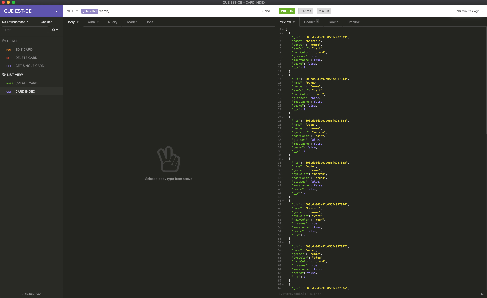

<h1>Qui Est-Ce</h1>

<h2>Technologies used</h2>
<ul>
<li>React JS</li>
<li>MongoDB</li>
<li>Mongoose</li>
<li>Node</li>
<li>Express</li>
<li>Axios</li>
<li>Insomnia</li>
<li>GitHub</li>
<li>Git</li>
<li>Yarn</li>
<li>Visaul Studio Code</li>
<li>Photoshop</li>
</ul>

<h2>The App</h2>

<p>Qui Est-Ce is the French version of the popular board game, ‘Guess Who’. ‘Guess Who?’ is commonly used by French teachers to teach students how to describe a persons facial features like hair colour, eye colour, if a person wears glasses or a person has a beard. The repetitive nature of the game is a great way to cement the concepts in a students head. I found it really useful when my French teacher introduced it to me and thought It would be a great app to build that could help others on their learning journey.</p>

<h3>How to use the App</h3>

<h2>Creating the app</h2>

<p>To plan the app and get a feel for how it could potentially work and look I built a series of wireframes in photoshop. My initial idea for the game is a user will need to have an account to play the game. So when they first lands on the site they will only have access to the, ‘home page’ and the ‘register-page’. Once a user has created an account they will be able to play the game and create there own character cards that will then be incorporated into the game.</p>

# 
# 
# 
# 
# 
# 

<h3>Backend</h3>

<p>To start off I created a , ‘package.JSON’ file and touched a, ‘index.js’ file. Added express and mongoose as dependencies. Imported express and mongoose into, ‘index.js’. Added a script into the, ‘package.JSON’ file to start the server. Created a server in, ‘index.js’ and tested it was running. Made a new connection to MondoDB with mongoose. Created a model for the cards that will be used in the game. Created a new GET request to retrieve all the cards data from the database. Created a new workspace in Insomnia that I will use to test each request after it’s written. Tested the GET request. Then moved onto creating a GET request for a single card, POST request to create a card, PUT request to edit a card and a DELETE request to delete a card.</p>

<p><strong>The image below is the Insomnia workspace I used in the project</strong> </p>

# 

<p><strong>The code snippet below is the database model for a card</strong></p>

```
const personCardSchema = new mongoose.Schema({
  name: { type: String, required: true, unique: true },
  gender: { type: String, required: true },
  eyeColor: { type: String, required: true },
  hairColor: { type: String, required: true },
  glasses: { type: Boolean, required: true },
  moustache: { type: Boolean, required: true },
  beard: { type: Boolean, required: true },
})
```
<p>Up to this point all the code had been written in the, ‘index.js’. Next I created a new folder titled, ‘controllers’ and inside ‘controllers’ made a new file titled ‘cards.js’ and moved all the requests written in, ‘index.js’ into the ‘cards,js’ file. Then moved onto creating a new folder titled ‘config’ and inside, ‘config’ made a new file titled ‘router.js’ to deal all requests made to the back-end. From here I moved onto creating a custom error handler that would at this stage would deal with any cast, not found or validation errors and tested the error handler in Insomnia. Testing the correct error was being thrown if incorrect details were provided in a request.</p>

<p>With the basic functionality of the back-end up and running I started working on the seed data for the cards. Creating a new folder titled ‘db’ inside, ‘db’ a folder titled ‘data’ and inside ‘data’ a file titled, ‘cards.js’ that holds an array of 15 card objects. With the seed data created I made a new file inside the, ‘db’ folder titled seeds. Inside seeds added a function that would seed the data base with 15 new cards each time the function was run. Then added another script to the, ‘package.JSON’ file to run the function from the terminal.</p>

<p><strong>The code snippet below an example of a card seed object</strong></p>

```
{
  name: 'Fanny',
  gender: 'femme',
  eyeColor: 'vert',
  hairColor: 'noir',
  glasses: false,
  moustache: false,
  beard: false,
},
```