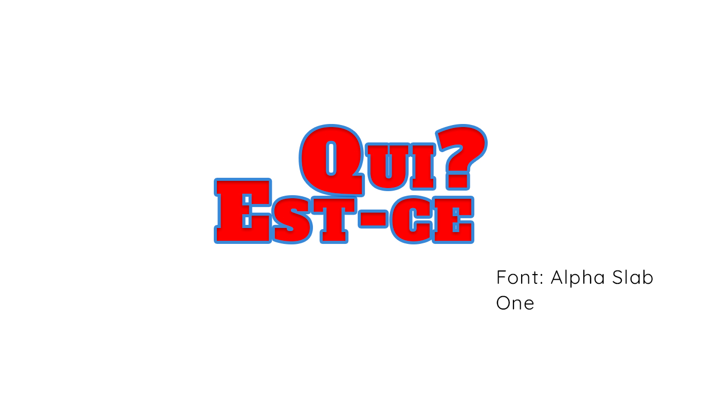
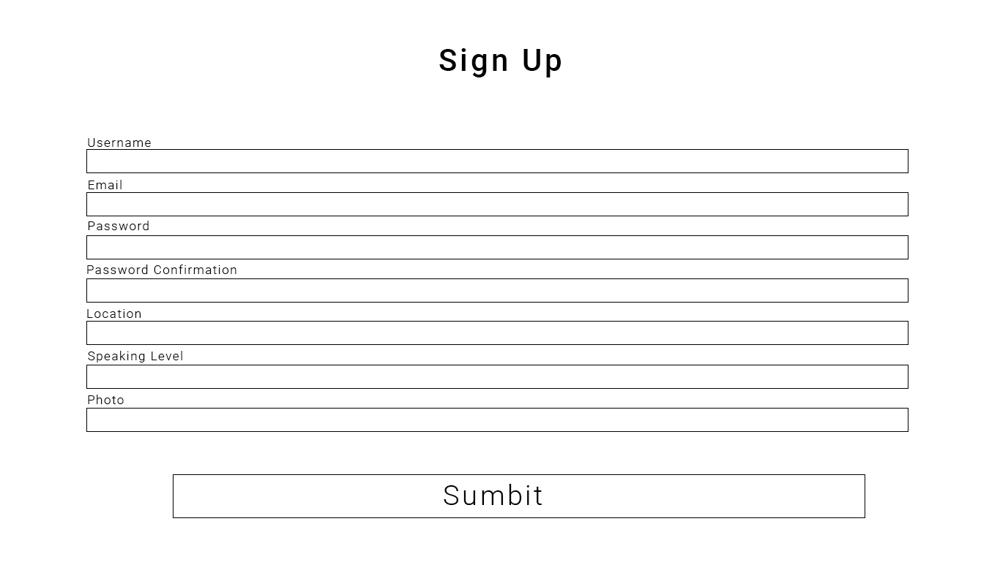
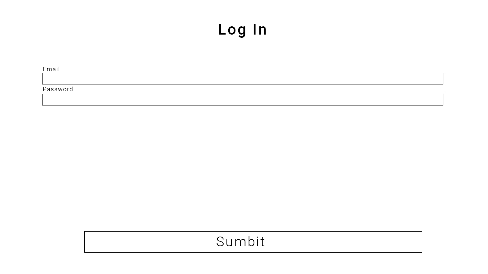
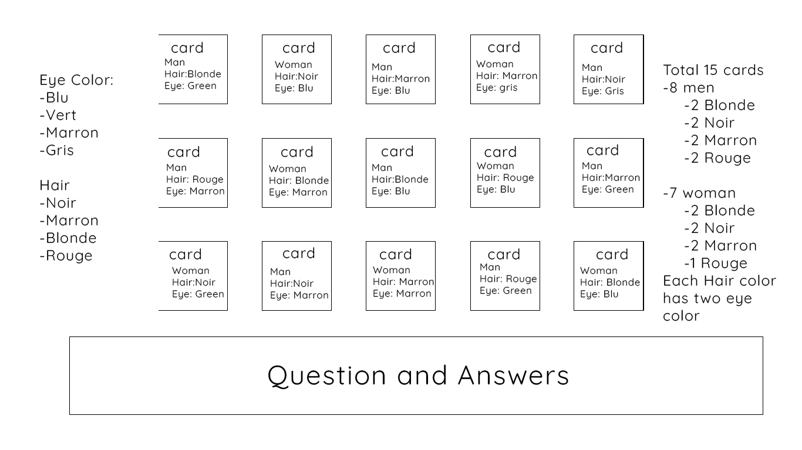
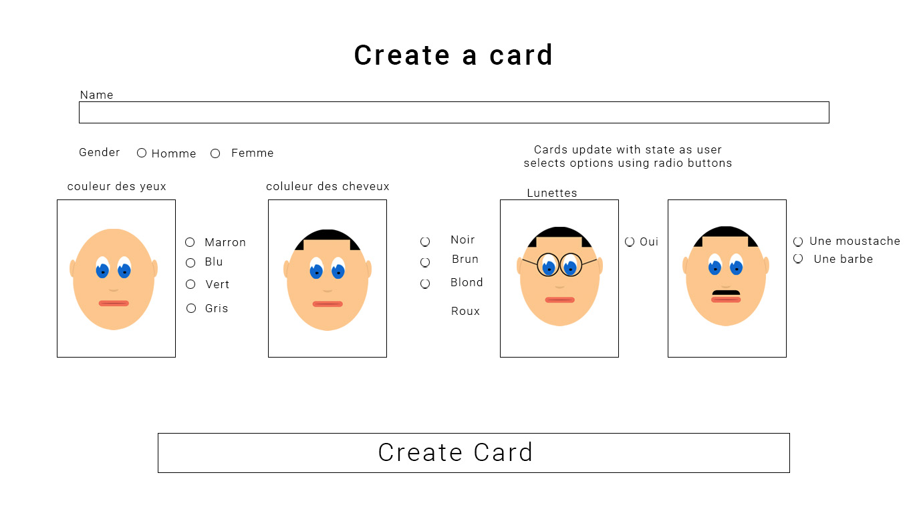

<h1>Qui Est-Ce</h1>

<h2>Technologies used</h2>
<ul>
<li>React JS</li>
<li>MongoDB</li>
<li>Mongoose</li>
<li>Node</li>
<li>Express</li>
<li>Axios</li>
<li>Insomnia</li>
<li>GitHub</li>
<li>Git</li>
<li>Yarn</li>
<li>Visaul Studio Code</li>
<li>Photoshop</li>
</ul>

<h2>The App</h2>

Qui Est-Ce is the French version of the popular board game, ‘Guess Who’. ‘Guess Who?’ is commonly used by French teachers to teach students how to describe a persons facial features like hair colour, eye colour, if a person wears glasses or a person has a beard. The repetitive nature of the game is a great way to cement the concepts in a students head. I found it really useful when my French teacher introduced it to me and thought It would be a great app to build that could help others on their learning journey.

<h3>How to use the App</h3>

<h2>Creating the app</h2>

To plan the app and get a feel for how it could potentially work and look I built a series of wireframes in photoshop. My initial idea for the game is a user will need to have an account to play the game. So when they first lands on the site they will only have access to the, ‘home page’ and the ‘register-page’. Once a user has created an account they will be able to play the game and create there own character cards that will then be incorporated into the game.

# 
# 
# 
# 
# 
# 

